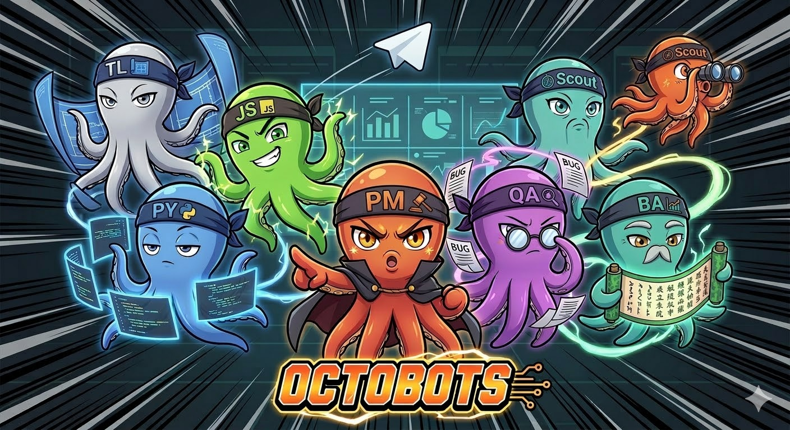

# Octobots



AI development team powered by Claude Code. Each role runs as a separate Claude Code instance in tmux, communicating via SQLite queue, with sessions mapped to GitHub issues and Telegram as the user interface.

## Quick Start

```bash
# 1. Seed a new project (one-time, manual)
octobots/start.sh scout

# 2. Start the team (all roles in tmux + dashboard)
octobots/supervisor.sh

# 3. Connect Telegram (in another terminal)
python3 octobots/scripts/telegram-bridge.py

# 4. Talk to Max via Telegram — or watch the team work
tmux attach -t octobots:dashboard
```

## Team

| Role | Name | Does | Doesn't |
|------|------|------|---------|
| **Scout** | Kit | Explores codebase, seeds config | Write code |
| **BA** | Alex | Goals → epics → user stories | Prescribe implementation |
| **Tech Lead** | Rio | Stories → technical tasks + deps | Distribute work |
| **PM** | Max | Distributes, tracks, unblocks | Implement or test |
| **Python Dev** | Py | Backend code, APIs, data | Frontend |
| **JS Dev** | Jay | Frontend, React, Node | Backend |
| **QA Engineer** | Sage | Tests, reproduces, verifies | Fix bugs |

## Architecture

```
User (Telegram)
  │
  ▼ send-keys
tmux "octobots"
├── project-manager ← Max receives messages directly, distributes via taskbox
├── python-dev      ← Py picks up tasks, works in git worktree
├── js-dev          ← Jay picks up tasks, works in git worktree
├── qa-engineer     ← Sage tests completed work in git worktree
├── ba              ← Alex writes user stories
├── tech-lead       ← Rio decomposes stories into tasks
└── dashboard       ← all panes tiled, auto-refreshing

Any role → notify-user.sh → Telegram (direct notifications)
```

### Communication — Three Channels

| Channel | Purpose | Persistence |
|---------|---------|-------------|
| **board.md** | Shared team state (decisions, blockers, findings) | In .octobots/ |
| **Taskbox** | Inter-role task assignment and coordination | SQLite, ephemeral |
| **GitHub Issues** | Permanent audit trail (every action gets a comment) | Forever |

### Session Management

Each GitHub issue maps to a Claude Code named session:

```
Issue #103 → session "python-dev-issue-103" → full context preserved
Issue #107 → session "python-dev-issue-107" → separate context
Back to #103 → /resume python-dev-issue-103 → context restored
```

No context blowup. Each task has its own session. Fully resumable.

### Worker Isolation

Code-writing roles (python-dev, js-dev, qa-engineer) get their own isolated environment per worker:

```
.octobots/workers/
├── python-dev/    ← own repo clones, own branch, own .env
├── js-dev/        ← own repo clones
└── qa-engineer/   ← own repo clones
```

No file conflicts between parallel workers. PRs are where integration happens.

## Structure

```
octobots/                            ← FRAMEWORK (git pull, read-only)
├── supervisor.sh                      Thin wrapper → scripts/supervisor.py
├── start.sh                           Launch a role interactively
├── roles/<role>/                      Base role templates
│   ├── SOUL.md                          Personality, voice, quirks
│   ├── CLAUDE.md                        Technical instructions
│   └── .claude/{skills,agents}/ →       Symlinks to shared
├── shared/
│   ├── agents/                        Shared agents (rca-investigator, etc.)
│   └── conventions/                   Teamwork, audit trail, sessions
├── skills/                            10 shared skills
└── scripts/
    ├── supervisor.py                  Rich TUI supervisor
    ├── telegram-bridge.py             Telegram ↔ tmux bridge
    ├── notify-user.sh                 Any role → Telegram notification
    ├── init-project.sh                Initialize .octobots/ for a project
    └── requirements.txt               Python deps (rich, telegram, dotenv)

.octobots/                           ← RUNTIME (project-specific, read/write)
├── board.md                           Team whiteboard
├── memory/<role>.md                   Per-role persistent learnings
├── roles/                             Project role overrides
├── skills/                            Project-specific skills
├── agents/                            Project-specific agents
├── workers/                           Isolated worker environments
│   ├── python-dev/                      Own repo clones + shared venv
│   ├── js-dev/                          Own repo clones
│   └── qa-engineer/                     Own repo clones
├── relay.db                           Taskbox database
└── profile.md, conventions.md, ...    Scout output
```

## Configuration

All config in `.env.octobots` (project root or octobots/):

```bash
# Telegram
OCTOBOTS_TG_TOKEN=your-bot-token
OCTOBOTS_TG_OWNER=your-telegram-user-id

# Workers (optional — auto-discovers from roles/ if not set)
OCTOBOTS_WORKERS=project-manager python-dev js-dev qa-engineer
OCTOBOTS_EXCLUDED_ROLES=scout

# Worktree roles (which roles get isolated git worktrees)
# Default: python-dev js-dev qa-engineer
```

## Watching the Team

```bash
# Dashboard — all workers tiled, auto-refreshing
tmux attach -t octobots:dashboard

# Individual worker — full interactive access
tmux attach -t octobots:python-dev

# Inside tmux:
# Ctrl+B, w — pick any window
# Ctrl+B, n/p — next/previous window
# Ctrl+B, d — detach (everything keeps running)
```

## Pipeline Flow

```
1. User → Max (Telegram): "We need user authentication"
2. Max → Alex (taskbox): "Analyze auth requirements"
3. Alex → Rio (taskbox): Epic + user stories with ACs
4. Rio → Max (taskbox): Technical tasks with dependencies
5. Max → Py/Jay (taskbox): Individual task assignments
6. Py/Jay work in worktrees, commit, create PRs
7. Max → Sage (taskbox): "Verify #103"
8. Sage tests, reports findings on GitHub issue
9. Any role → User (notify-user.sh): status updates via Telegram
```

## Adding a New Role

```bash
mkdir -p octobots/roles/my-role/.claude/{skills,agents}
# Create SOUL.md, CLAUDE.md, MEMORY.md
# Symlink skills and agents:
cd octobots
for skill in skills/*; do
  ln -s "../../../../$skill" "roles/my-role/.claude/skills/$(basename $skill)"
done
ln -s "../../../../shared/agents/taskbox-listener" "roles/my-role/.claude/agents/taskbox-listener"
# Role auto-discovered by supervisor on next restart
```

## Documentation

- [Setup Guide](docs/setup.md) — Installation, first run, Telegram, troubleshooting
- [Architecture](docs/architecture.md) — Design principles, components, session management
- [Skill Spec](docs/skill-spec.md) — How to create new skills (agentskills.io standard)

## License

Apache-2.0
